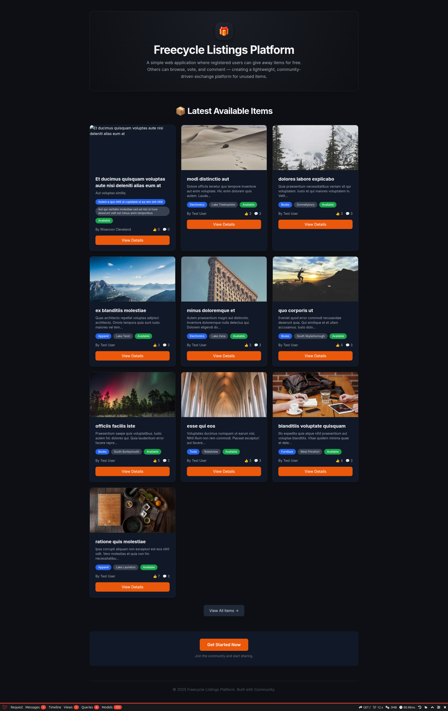
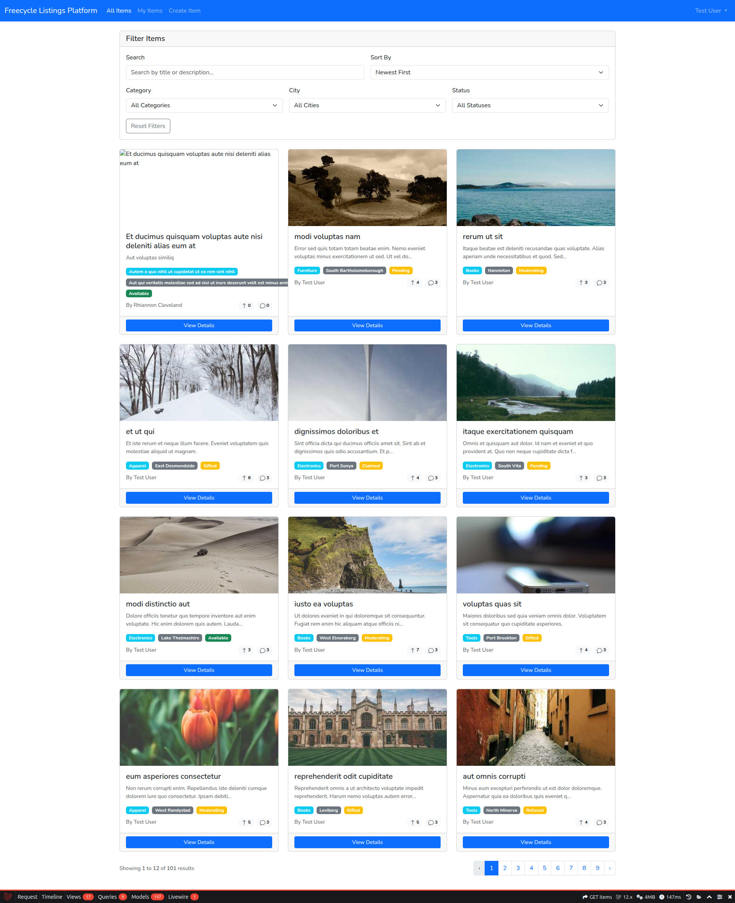

# 🎁 Freecycle Listings Platform


---

## 🎯 Project Overview

**Freecycle Listings Platform** is a community-driven **Laravel + Livewire** application where registered users can give away items for free.

Key aspects of the platform:

- Users can **browse, filter, and search** listings by category, city, status, or keyword.
- Each item has **attributes** such as title, description, category, city, photos, and status (Available / Gifted / Pending / Moderating / Claimed / Refused).
- Users can **create, edit, and delete** their own listings.
- Listings include **votes and comments**, enabling community feedback and interaction.
- Filters include:
    - **Text search** by title or description
    - **Category and City** selection
    - **Status filter** (Available / Gifted / etc.)
    - **Sort options** (Newest, Oldest, Most Upvoted)
- Users see **toast notifications** when performing actions like updating or deleting listings.
- **Authorization** ensures that only item owners can update or delete their listings.
- Admins can moderate items and users.

This creates a **clean, interactive platform** for giving away items while maintaining a structured and safe community environment.

[Live preview](https://borschcode.github.io/free-share-platform/index.html)





---

## 🚀 Quick Start

This project uses **Docker Compose + Laravel Sail** for local development.

### Prerequisites
- Docker installed & running
- Any terminal shell (Bash, Zsh, etc.)

### Setup Steps

1️⃣ **Start Docker Containers**
```bash
docker compose up -d --build
````

2️⃣ **Install Dependencies**

```bash
docker compose run --rm php composer install
# Or, if Sail is installed locally:
./vendor/bin/sail composer install
```

3️⃣ **Configure Environment**

```bash
cp .env.example .env
./vendor/bin/sail artisan key:generate
```

4️⃣ **Run Database Migrations + Seeders**

```bash
./vendor/bin/sail artisan migrate --seed
```

5️⃣ **Create Storage Symlink**

```bash
docker compose run --rm php php artisan storage:link
```

6️⃣ **Access the Application**

* **App:** [http://localhost:8059](http://localhost:8059)
* **Mailpit (Email Testing):** [http://localhost:8025](http://localhost:8025)

---

## 👥 Test Accounts

To quickly test the application after running the seeders (`php artisan migrate:fresh --seed`), you can use these static accounts:

| Role/Name               | Email Address      | Password   |
| ----------------------- | ------------------ | ---------- |
| **Test User** (General) | `test@example.com` | `password` |
| **Admin User**          | `admin@test.com`   | `password` |
| **Jane Doe** (Standard) | `jane@test.com`    | `password` |

> Note: The seeder also creates 10 random users with random passwords, but the static accounts provide quick and consistent login access.

---

## 🧰 Useful Sail Commands

| Task           | Command                             |
| -------------- | ----------------------------------- |
| Run migrations | `./vendor/bin/sail artisan migrate` |
| Tinker console | `./vendor/bin/sail artisan tinker`  |
| Run tests      | `./vendor/bin/sail test`            |
| Compile assets | `./vendor/bin/sail npm run dev`     |

---

## ✨ Features

### 🔐 Authentication

* Only registered users can access the main application.
* Guests are redirected to the login/registration page.

### 📦 Item Listings

Each item includes:

* **Title, description, category, city**
* **Optional:** weight, dimensions
* **Photos:** one or more uploads
* **Status:** `available` / `gifted`

Users can:

* Create new listings
* Edit their own listings
* Mark items as *gifted*

### 🔍 Browsing & Filtering

* Paginated listings with thumbnails
* Filter by **category**, **city**, or **status**
* Text search (title/description)
* Sorting: **newest** or **most upvoted**

### 📝 Item Details

Each listing page displays:

* Full description
* All photos
* Owner information
* Comments & voting controls
* **“Gifted” badge** when applicable

### 👍 Interactions

* Upvotes & downvotes (one per user per item)
* Commenting on listings
* Dynamic UX with minimal full-page reloads

---

## 🧱 Conceptual Data Model

* **User**
* **Item**
* **Category**
* **Comment**
* **Vote**
* *(Optional)* Photo/Image entity

---

## 📄 License

This project is open-source and available under the **MIT License**.
